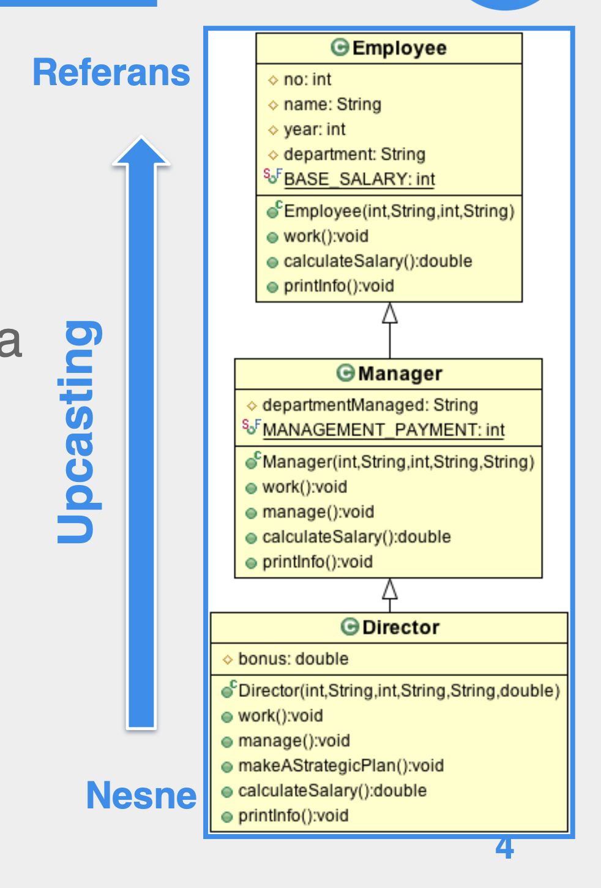

# Section 1: Çok Şekillilik

## 1. Upcasting

- Bir Referansı ya da nesneyi onun üst tipinden bir referansa atamaya **upcasting (yükseltme)** denir.
- **Upcasting,** gerine geçebilme **(substitutability)** özelliği sayesinde güvenlidir, **cast ()** operatörü kullanmaya gerek yoktur.
    
    
    
    
    
- Upcasting sıkılıkla metot parametrelerinde görülür.

## 2.  Çok Şekillilik

- **Polymorphism** çok şekillilik demektir.
- Çok şekilli olan şey referanslardır.
- **Polymorphism** bir referansın, zamanın farklı anlarında, kendi ya da alt tipinden olan nesneleri gösterebilmesine denir.

- **Polymorphism** sayesinde, arayüz (üst tipe ait referans) ile gerçekleştirmeyi (bu referansın çağırdığı üye metotlar) ayırabiliriz.
- **Polymorphism** daha güzel bir tanımla, iki referansın birbirleriyle haberleşip, birbirlerinin gerçek tiplerini bilmemeleri demektir.
- Elimizde bir kalıtım hiyerarşisi varsa, istemcimizi o hiyerarşinin arayüzünü belirleyen en üst tipine göre yazın, alttaki sınıfları, gerçekleştirmeleri göz önüne almayın, onlara özel kod yazmayın.
- Bu şekilde istemciler, hiyerarşideki ekleme ve çıkarmalardan etkilenmez.

## 3. Çok Şekilli Metotlar

- Bir metodun **polymorphic** yani çok şekilli olması, arayüzün sabit olmasına rağmen, overriding sayesinde, pek çok gerçekleştirmeye sahip olması anlamına gelir.
- Farklı gerçekleştirmeler (metot tanımları), aynı arayüzün arkasında saklanabilir, birbirleri yerine geçecek şekilde kullanılabilir.
- Bir metodun arayüzü, o metodun kendisi üzerinde çağırıldığı referansın tipi tarafından belirlenir.
- O metodun hangi gerçekleştirmesinin çalışacağı ise referansın gösterdiği nesne tarafından belirlenir.
- Ama gerçekte hangi metodun çağırılacağı, referansın gösterdiği nesneye bağlı olduğundan ve bu da ancak çalışma zamanında belli olacağından, derleme zamanında bilinemez.

## 4. Binding

- **Binding (bağlama),** değişken, metot vb. özelliklerin dilin elemanlarıyla ilişkilendirilmesidir.
    - Örneğin Java’ da * sembolünün matematiksel çarpma işlemine bağlanması dilin tasarım zamanında yapılmıştır.
    - Ya da `int i;` ifadesi `i` ile tipi olan `int` arasındaki bağ derleme zamanında kurulmuştur.
- Dillerde temelde iki bağlama zamanı önemlidir.
    - **Statik Bağlama (static binding):** Statik bağlamada özelliklerin, dilin elemanlarıyla ilişkilendirilmesi çalışma zamanından önce yapılır ve programın çalışması sırasında değişmez.
    - **Dinamik Bağlama (dynamic binding):** Özelliklerin, dilin elemanlarıyla ilişkilendirmesi runtime esnasında yapılır ve runtime esnasında değişebilir.
- Metot polymorphism, dynamic binding (dinamik bağlama) demem bir teknikle yapılır.
- Önce **Operation (message)** ve **metot (method)** arasındaki ayrımı açıklayalım.
    - Bu ayrım nesne yönelimli dillerde söz konusudur.
        - Operation (ya da message) ile soyut olarak yani arayüz seviyesinde bir referansın üzerinde çağırılabilecek olan davranışlar kastedilir.
        - Method ise bir nesnenin üzerinde çağırılan davranışın kendisidir.
    - Operation arayüz, metot ise gerçekleştirme demektir.
- Operation (ya da message) daha çok bir kalıtım hiyerarşisinde birden fazla gerçekleştirmesi olan ve hiyerarşinin en tepesindeki tanımlanan metodun arayüzünü, metot ise o hiyerarşideki gerçekleştirmeleri temsil eder.
- Operation daha çok tasarım ve derleme zamanı, metot ise derleme ve çalışma zanı yapısıdır.
- Statik bağlamada her şey çalışma zamanından önce belirlemir.
    - Genel olarak prosedürel dillerdeki metotların bağlanmaları statiktir.
- Java’ da `static` , `private` veya `final` olan metotlar statik olarak bağlanır.

- **Static** metotlar kalıtım hiyerarşisi söz konusu olsa bile referansın tipi üzerinde tanımlı sınıftan çağırılırlar, referansın gösterdiği nesnenin sınıfından değil.
- Statik bağlanan metotlar dinamik bağlananlara göre daha hızlı çalışma eğilimindedirler çünkü statik bağlama çalışma zamanında yapılacak işleri derleme zamanına çeker.
    - Bundan dolayı, override edilmeyen metotları `final` olarak işaretleyerek runtime performansını artıran araçlar vardır.

## 5. Sonuçlar

- **Polymorphism,** bir hiyerarşideki nesneleri, hiyerarşinin en tepesindeki nesne cinsinden ifade ettiğinden, alt sınıfın nesneleri de tepe sınıfın nesnesi olarak görülür.
    - Bu nedenle **polymorphic** tasarımda alt sınıfların kendilerine has özelliklerini kullanamayız.

## 6. Downcasting ve instanceof

- Üst tipten olan bir referansı ya da nesneyi alıp alt tipinden bir referansa atamaya **downcasting (alçaltma)** denir.
- **Downcasting** ile referansları, gösterdikleri nesnenin gerçek tipine atayabiliriz.
    - Bu bazen gerekli olur ve kaçınılmazdır.

- Objenin tipini gerçek referansına cast ediyorsak problem yok ama yukarıdaki örnek runtime hatasıdır.

- Cast operatörü kullanarak çevrim yaparken, cevirimin uygun bir tipe yapılmamasından doğacak `ClassCastException` sıra dışı durumunu önlemenin yöntemi, `instanceof` operatörü ile `if` kontrolü yapmaktır.

- `instanceof` operatörünün kullanımı için tipler arasında miras hiyerarşisi olmak zorundadır, aksi taktirde compiler error dur.
- `instanceof` operatörü, sağındaki tipin alt tipinden olan tüm referanslar için `true` döndürür.

- `instanceof` operatörü ile referansların gösterdiği nesnelerin gerçek tiplerini belirlemeye **RunTime Type Identification** (**RTTI**) denir.