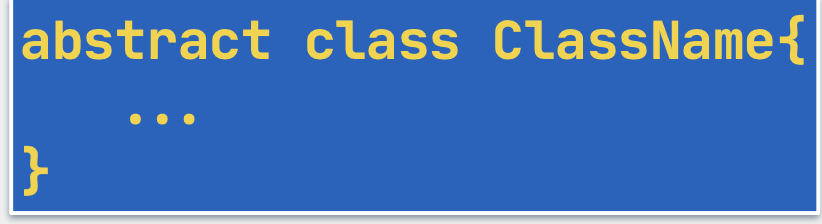
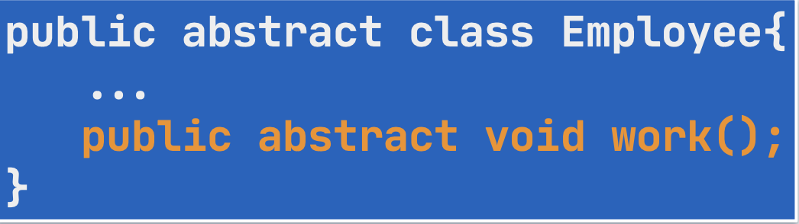

# Section 2: Soyut Sınıflar

## 8. Soyut Sınıf ve Metot

- Nesnesine ihtiyaç olmayan sınıfları, nesnesi üretilememesi için sınırlayarak **soyut sınıf (abstract class)** oluşturabiliriz.
- Bu sınıflar kalıtım hiyerarşisinde alt sınıflar için bir kalıptır şablondur.
- Alt sınıfların ortak özelliklerini bir araya toplayarak **polymorphism** için gerekli olan üst tipi temsil ederler.
- sınıf tanımında `abstract` anahtar kelimesi kullanılır.
    
    
    
- Arayüzü olan ama gerçekleştirmesi olmayan metotlara **soyut metot (abstract metot)** denir.
    - Kodu olmadığı için tanımı sırasında `{}` kullanılmaz.
        
        
        
- Soyut metotlar ancak soyut sınıflarda bulunur.
- Bir sınıfın soyut olması için soyut metoda sahip olmasına gerek yoktur.
    - Ancak bir tane bile soyut metoda sahip bir sınıf, soyut olmak zorundadır.
- Metotları soyut olmayan bir sınıfın `abstract` sınıf yapılmasının sebebi, o sınıfı miras alan diğer sınıfların override etmek zorunda kalmadan o metotları kullanabilmesini sağlamaktır.

## 9. Soyut-Somut Sınıf ve Miras

- Temel fark, somut sınıfın `extends` ile devralırken üst sınıfın metotlarını implement etmesine gerek yokken, soyut sınıflarda alt sınıflar ya implement etmelidir ya da o sınıf ta soyut olmalıdır.
- Nesneleri oluşturulabilen sınıflara **somut (concrete)** sınıf denir.
- Soyut sınıflar ve metotlar `final` olamazlar.
- Bir soyut metot sadece ve sadece `public` ya da `protected` erişim niteleyicilerini alabilir.
    - Soyut metotlarda `static` , `synchronized` vb. niteleyiciler de kullanılamaz.
- Bir soyut sınıf `main` metot içerebilir.