# Section 3: Arayüzler

## 13. Arayüz Nedir? ve interface Anahtar Kelimesi

- **Arayüz (interface),** en kısa tanımıyla, tüm metotları soyut olan sınıftır.
- Arayüzlerin metotları varsayılan halde `public`  ve `abstract` olur.

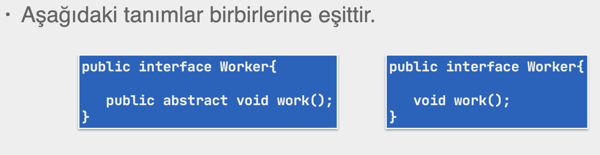

- Java SE 8 den önce arayüzler **gerçekleştirme (method implementation)** sağlayamıyorken artık sağlayabiliyor ve `abstract` sınıflarla arasındaki fark bir nebze azalmıştır.

## 14. Arayüzü Gerçekleştirme

- Bir sınıf bir arayüzün alt tipi olup ondan miras devralırken `implements` anahtar kelimesini kullanır.
- Bir sınıf, bir arayüzü implement eder.

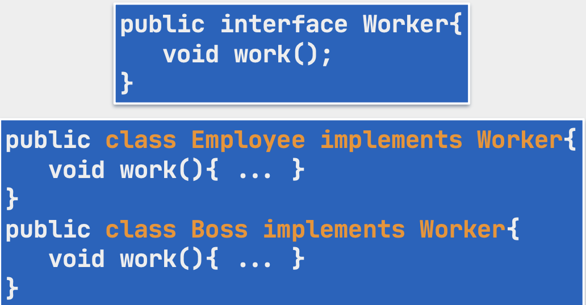

- Arayüzlerin metotları erişim belirteci vermediğimiz durumlarda default değil `public` erişim belirtecine sahiptirler.

## 15. Arayüz ve Yetkinlikler - I

- Arayüzlerin **is-a** hiyerarşisinde bir üst tip olarak görülmesi yanında, yetkinlik kazandırması da söz konusudur.
- Bir sınıf birden fazla arayüzü yerine getirebilir.
- Nesneler, sınıflarının yerine getirdikleri arayüzler ile pek çok yetkinlik kazanır.
    
    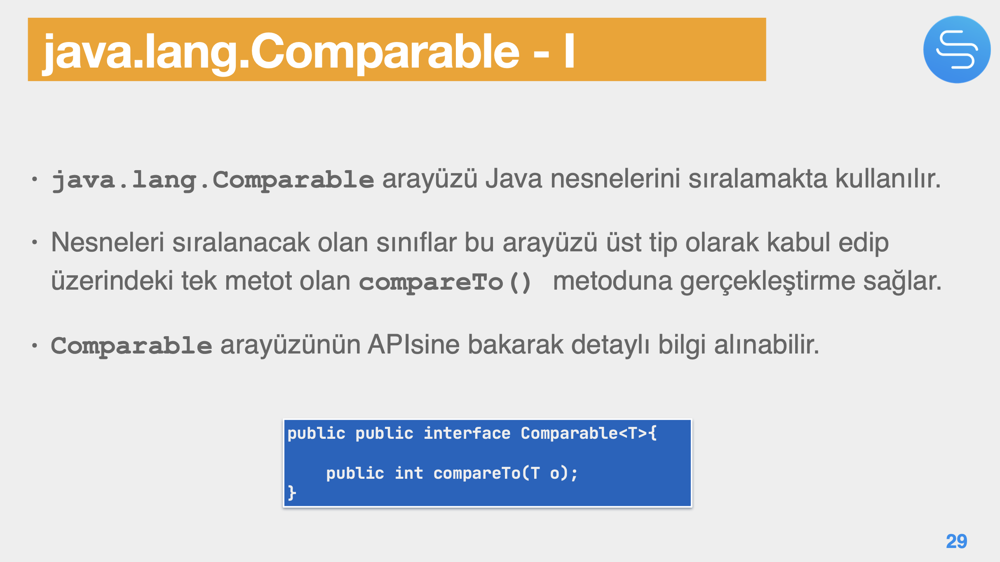
    

## 16. Arayüz ve Yetkinlikler - II

- Arayüzler sayesinde **düşük bağımlılık (low coupling)** ya da **gevşek bağımlılık** gerçekleştirilir.
- Arayüzler bir gerçekleştirmeye sahip olmadıklarından, arayüzü `implenments` eden sınıflara ortak olan gerçekleştirmelerin bir soyut sınıfta tanımlanması mümkündür.
- Aradaki bu sınıf soyuttur çünkü arayüzdeki bütün metotlara gerçekleştirme veremez.
    - Nesnesi oluşturulamaz.
    - Aksi durumda alt sınıflarda tekrar edecek olan metot gerçekleştirmesi gibi kodları bir yerde toplar. Tekrar kullanımı sağlar.
        
        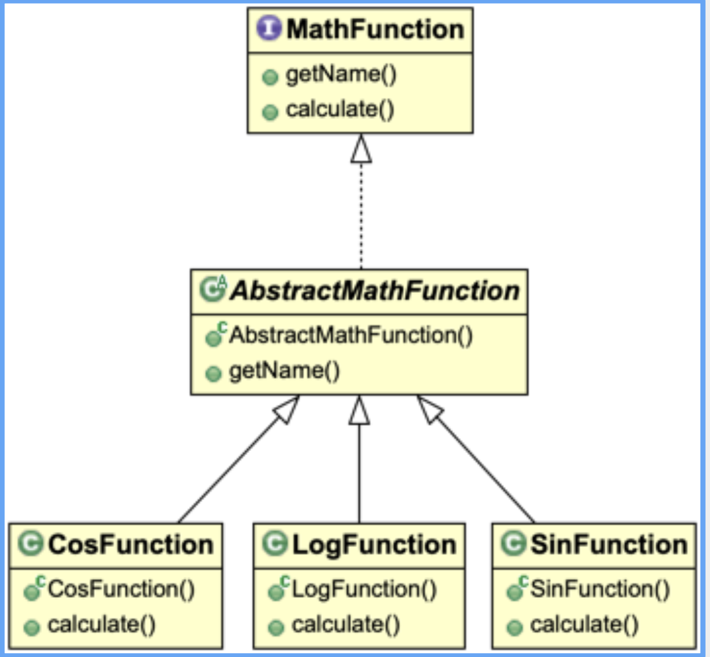
        

## 17. Arayüz ve Miras - I

- Bir sınıf aynı anda birden fazla arayüzü gerçekleştirebilir.
- Bu durumda sınıfın, yerine getirdiği arayüzlerden devraldığı tüm metotlara gerçekleştirme vermesi gerekir.
    - Aksi takdirde o sınıf soyut olmak zorundadır.
        
        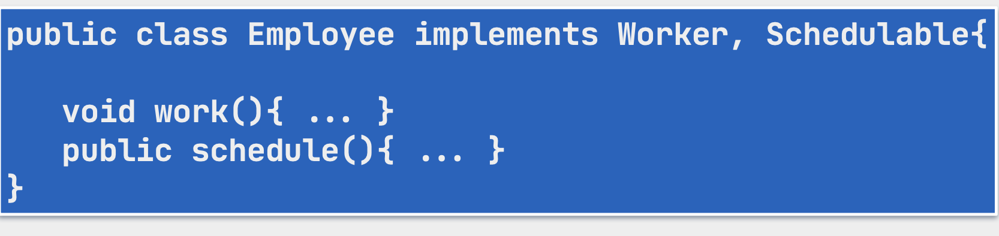
        
- Bir sınıf hem bir sınıftan miras alırken hem de bir ya da daha çok arayüzü gerçekleştirebilir.
    
    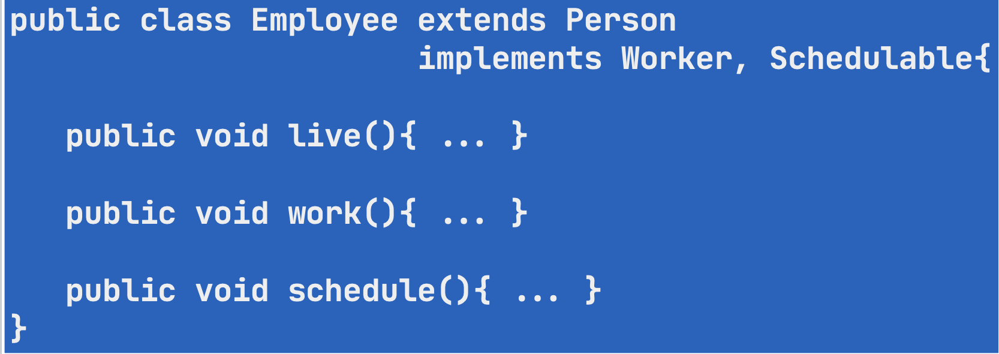
    

- Java api’ sindeki arayüzlerden bazılarında hiç metot yoktur.
- Örneğin,
    - `java.io.Serializable`
    - `java.lang.Cloneable`
    - `java.util.RandomAccess`
- Bir arayüzde hiç metot olmamasının açıklaması;
    - Bu tip arayüzlere **marker interface** denir. Gerçekleştirmesi low level programlama bilgisi istediği için java geliştiricileri bu arayüze metot koymak yerine, JVM bu marker’ e sahip sınıfların bu low level özelliklerini otomatik olarak gerçekleştirir.
- Arayüz metotları, `public` erişime sahiptirler.
    - Dolayısıyla bu metotlar alt sınıflarda gerçekleştirilirken de `public` olmak zorundadırlar.
    - Çünkü metotlar `override` edilirken daha kısıtlayıcı bir erişim belirteci ile tanımlanamazlar.
- **Yerine geçebilme (substitutability)** özelliği arayüz ve onun alt sınıfları için de geçerlidir.
- Arayüzler durum (state) sağlamazlar.
    
    
    
- Arayüzde tanımlanacak tüm alanlar otomatik olarak `public` , `static` ve `final` olurlar.
    - Bu yüzden bu alanlar için başka bir erişim belirteci kullanılamaz.
    - Ve tüm alanlara bir ilk değer vermek zorunludur.
    - Bu yaklaşım const değişkenlerle aynı olduğu için Upper snake case tipinde yazılırlar.

## 18. Arayüz ve Miras - II

- Arayüzlerin kurucuları yoktur.
    - Bu arayüzlerin hiç state sağlamıyor olmalarından da anlaşılabilir.
- Bu yüzden arayüzü gerçekleştiren sınıfların kurucularında, arayüzden kaynaklanan `super()` çağrıları bulunmaz.
    - `super()` çağrısı varsa da miras devraldığı sınıf içindir.
- Arayüzler de birbirlerinden miras devralabilirler.
    - Bu durumda bir arayüz, kendisinden miras devraldığı diğer arayüzü genişletir.
        
        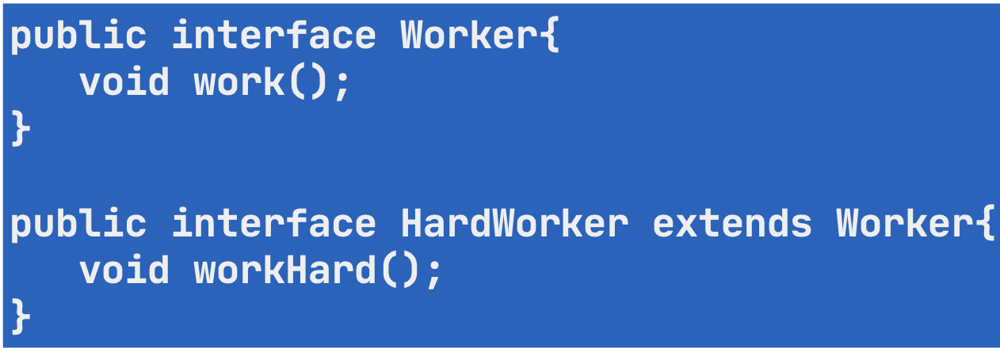
        
- Bir arayüz birden fazla arayüzden miras devralabilir. Bu durumda miras alınan arayüzlerin virgül ile ayırılmaları gerekir.
- Bir **enum**, arayüzlerden miras alabilir.
    - Devraldığı metotlara gerçekleştirme vermek zorundadır çünkü **enum** tipi `abstract` olamaz.

## 19. Tip Kavramı

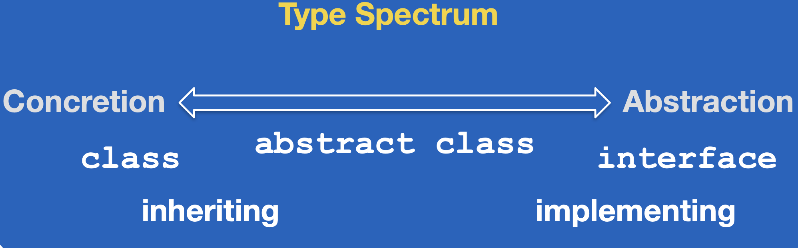

- Enumlar da bu tip spektrumunda sol tarafta class’ ın yanında dururlar.
- Bir hiyerarşide soyut-somut sınıf ve arayüz olarak birden fazla üst tipe sahip olan bir nesnenin birden fazla tipi var demektir.
    - Ve nesne o tiplerin her birinden olan referanslar ile temsil edilebilir.
- Aynı nesnenin hangi bağlamda hangi tipini ortaya koyduğunu belirleyen şey de o nesneyi temsil eden referanstır.
    
    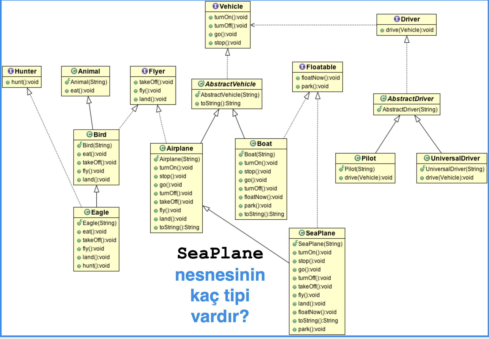
    
- `SeaPlane` nesnesini; `SeaPlane` , `Airplane` , `Flayer` , `AbstractVehicle` , `Vehicle` , `Floatable` ve `Object` olamak üzere 7 farklı referans tipinde temsil edebiliriz.
    
    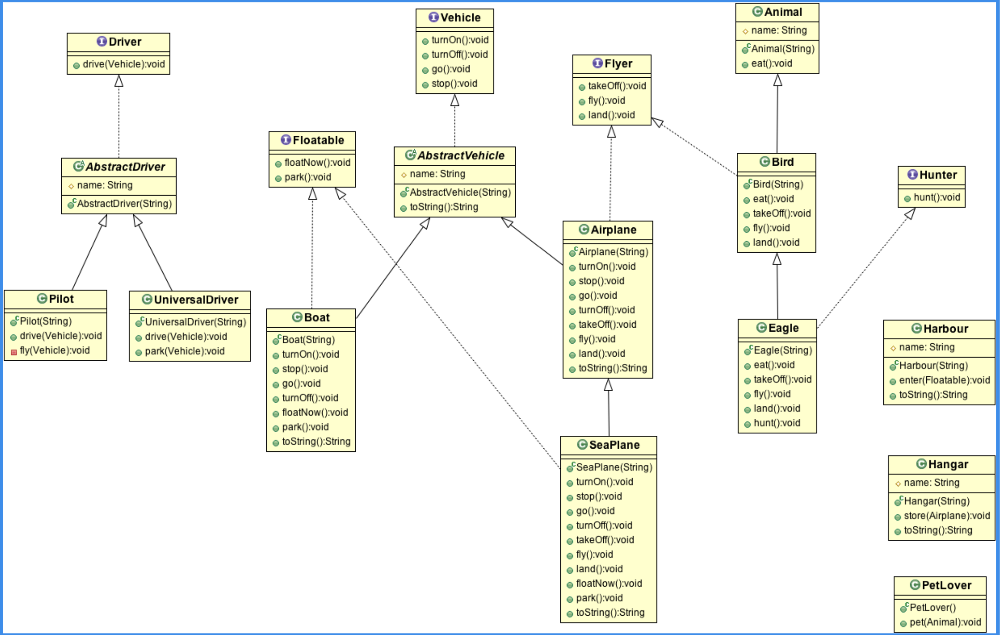
    
- `SeaPlane` nesnesini `Harbour` (liman)sınıfının `enter(Floatable):void` metoduna parametre geçebilirim çünkü `SeaPlane` bir `Floatable` ’ dir.
- `SeaPlane` nesnesini `Hangar` sınıfının `store(Airplane):void` metoduna parameter geçebilirim çünkü `SeaPlane` bir `Airplane` ’ dir.

## 20. Geri Çağırma Metotları

- Geri çağırmayı Java’da kurmak için olayın kaynağına, fonksiyon değil, üzerinde belirli bir metot olan nesne geçilir.
    - Çünkü Java nesne merkezlidir, tek başına bir metot hiçbir yere geçilemez
    - Ayrıca nesne geçilmesi durumu çok daha geniş bir hareket alanı sağlar.
- Bu durumda olayın kaynağı olan nesnenin, olayın olması durumunda hangi metodu çağıracağını bilmesi gerekir.
- Bu sebeple Java’da geri çağırma nesneleri, üzerinde genelde bir tane metot olan arayüzlerden türetilir.

## 21. Arayüz Yenilikleri

- Java SE 8 ile arayüzlere
    - Default varsayılan metotlar ve
    - static metotlar geldi
- Bu iki tür metotlar şu ana kadar söylenen “arayüzler sadece şekil/form sağlar, gerçekleştirme sağlamaz” prensibini delen yeniliklerdir.
    - Bu metotlar soyut (abstract) değillerdir, gerçekleştirmeleri vardır.
- Java SE 9 ile arayüzlere `private` metot da geldi.

## 22. Arayüz Yenilikleri a - default Metotlar

- **Functional Programming** özellikleri Java’ya eklenince arayüzlere de yeni metotlar eklenmesi zorunluluğu doğdu.
    
    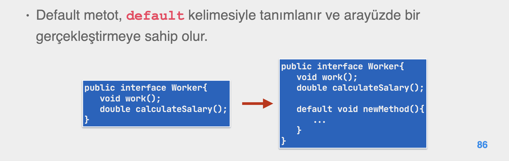
    
- `java.lang.Object` sınıfındaki (hashCode(), toString() vb.) metotlar asla bir arayüz üzerinde varsayılan olarak tanımlanamaz.
    - Eğer böyle olsaydı, o arayüzün tüm alt sınıflarında bu gerçekleştirme kullanılırdı.
    - Ama bu mümkün değildir, mümkün olan bu metotları hiyerarşinin üstündeki sınıfta override etmek ve alt sınıfların aynen kullanmasına izin vermektir.
- **Binary compatibility** (**ikili uyumluluğu**), daha önce birlikte çalışan iki yapıdan birisinin değişmesine rağmen, yeni sürümünün diğer yapıyla hala uyumlu bir şekilde çalışabilmesine denir.
    - İkili uyumluluk, derlenmiş yapılar, **.class** dosyaları seviyesindedir.
    - Eğer bir projedeki bir arayüze yeni bir metot ekledikten sonra derleyip projeye eklerseniz, var olan yapılar, arayüzün yeni sürümüyle çalışmaya devam edeceklerdir.
    - Ancak bu yeni arayüzü kullanan yapıları tekrar derleyip class dosyalarını yenileyecek olursak bu sefer gerçekleştirmesi olmayan arayüzlere hata üretecektir.
        - Bunun çözümü de arayüze yeni metot eklerken default method eklemektir.

## Arayüz Yenilikleri b - static Metotlar

- Java SE 8 ile birlikte arayüz üzerinde statik metot tanımlanabilir.
    
    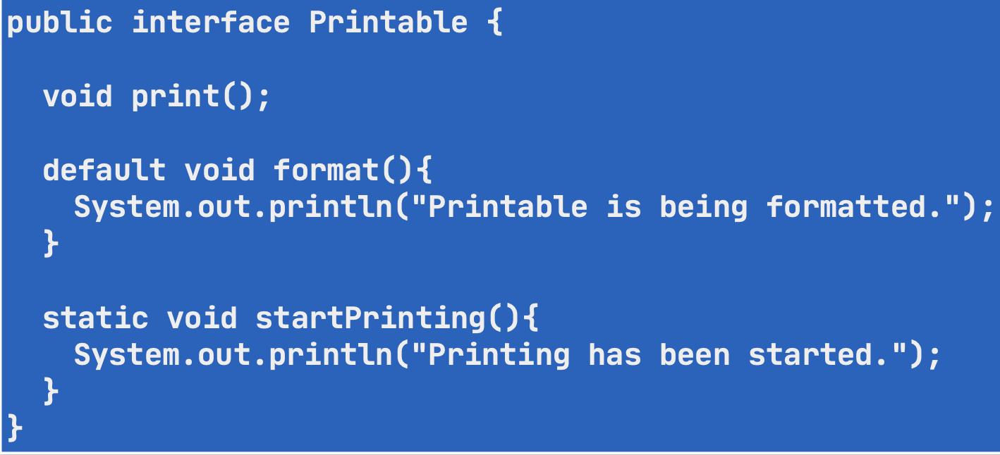
    
- statik metotlar da diğer tüm metotlar gibi daima `public` tanımlıdırlar.
- Arayüz üzerindeki statik metotlar, arayüzü genişleten arayüzler ya da gerçekleştiren sınıflar tarafından devralınamazlar, bu yüzden statik metotlar sadece ve sadece tanımlandığı arayüz üzerinde çağırılırlar.
- Java SE 8’ e kadar statik metotlar sadece sınıflarda tanımlanabilirdi.
    - Bu yüzden, arayüzlerde ifade edilen soyut nesne metotlarına yardımcı mahiyetteki araçsal metotlar (utility methods), araçsal sınıflarda (utility classes) statik olarak tanımlanırdı.
    - Bu da projelerde aşırı miktarda statik metota sahip olan araçsal sınıfların yaygın olarak kullanılmasına neden oldu.
    - Bu tür araçsal sınıfların **birliklelikleri (cohesion)** düşük, **bağımlılıkları (coupling)** ise yüksek olmaktadır.
- Artık stratejik olarak bu araçsal metotların **utility class**’ lara  koyulmaması, hangi interface ile ilişkili ise ona konmasının önü açılmıştır.

## 24. Arayüz Yenilikleri c - private Metotlar

- Java 8’ de Arayüzlere koyulan static ve default metotların tekrar eden kod satırlarını ayrı bir metoda çıkartmak istendiğinde bunu yeni bir default metoda koymak zorundaydık, default metotlar `public` olacağından bu arayüzün kendi iç işleyişinde kullanılacak helper metodu dışarıya açmak anlamına geliyordu.
    - Bu nedenle Java 8 ile başlayan, arayüzlere implementation koyma yenilikleri, Java 9’ da `private` metot ile devam etti.
- `private` metot statik ya da nesne metodu olabilir.
- `private` metot `default` olamaz, çünkü default metotlar alt sınıflarda override edilebilir.