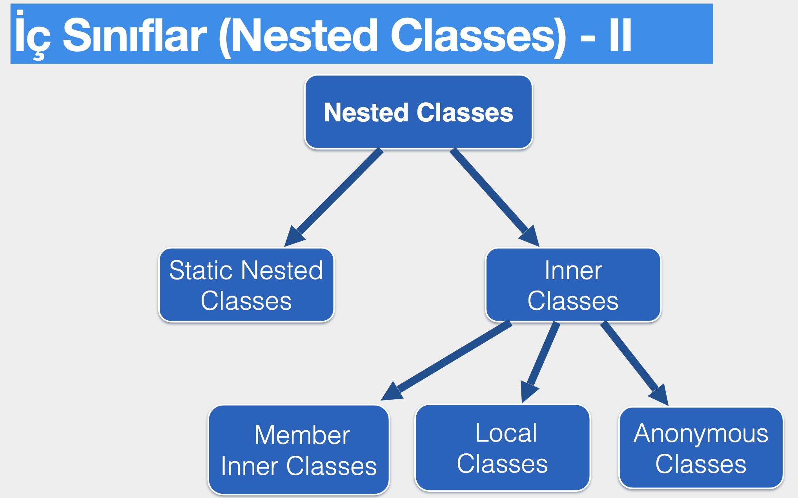

# Section 4: İç Sınıflar

## 26. Yüksek Seviyeli Sınıf ve İç Sınıf

- Başka bir sınıfın içerisinde tanımlanan sınıflara iç sınıf (nested class) denir.
- Genelde statik olan ve olmayanlar olarak ikiye ayrılır.
    
    
    
- Üye iç sınıflar, statik olsun - olmasın, `public` , `protected` , `private`  ve paket erişimli olarak tanımlanabilirler.
-