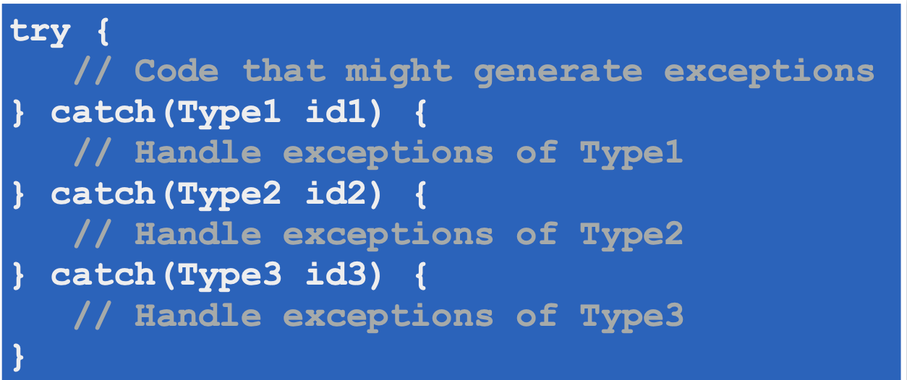

# Section 5: Sıra Dışı Durum Yönetimi

## 32. Giriş

## 33. Temeller

- **Sıra dışı durum** (**exception**): Sıra dışı durumun kendisidir, durum ile ilgili bilgileri de taşır.
- **Fırlatma** (**throw**): Sıra dışı durumu oluşturup JVM’e bildirmektir.
- **Yükseltme** (**raise/propagate**): Sıra dışı durumu bir üst bağlama göndermektir.
    - Exception üreten metodun, o sıra dışı durumu, kendisini çağıran metoda geri döndürmesidir.
- **Yakalama** (**catch**, **handle**): Fırlatılan sıra dışı durumun, yönetilmek üzere özel bir kod parçasına girmesidir.
- **Çağrı zinciri** /**yığını** (**call chain**/**stack**): Metotların birbirlerini çağırmalarından doğan zincir ya da yığındır.
- **Yığın izi** (**stack trace**): Herhangi bir anda aktif olan metot pencerelerinin (method frame) yığındaki durumudur.

## 34. Geleneksel Sıra Dışı Durum Yönetimi

## 35. Java'da Sıra Dışı Durum Yönetimi

- Java’da sıra dışı durum yönetimi için **try-catch** bloğu kullanılır.
- Sıra dışı durum fırlatma ihtimali olan kod `try` bloğunda, fırlatılabilecek sıra dışı durumları yakalayacak kod ise `catch` bloğuna konur.
- Alternatif olarak sıra dışı durumu fırlatıldığı ilk yerde yönetmeyip bir üst bağlama da yükseltebiliriz.
    - Bu durumda `throws` anahtar kelimesi kullanılır.
- Sıra dışı durumun kim tarafından yakalanacağına ve kimler tarafından yükseltileceğine tasarım aşamasında karar vermek gerekir.
    - Yakalayan, o durumu düzeltmek için bilgiye sahip olandır.
    - Ya kendisi düzeltir ya da düzeltecek olan nesnelere yönlendirir.
    - Düzeltemeyecek olanlar da sıra dışı durumu yükseltir.

## 36. Java'da Sıra Dışı Durum Yönetimi a - Throwable

- Java’ da tüm hatalar ve sıra dışı durumlar **Throwable** sınıfıyla temsil edilir.
- JVM ya da kod içerisindeki metotlardan fırlatılan tüm nesneler bu sınıfın ya da alt sınıflarının bir nesnesi olmak zorundadır.
- `Thorowable` kurucuları:
    
    
    
- metotları:
    
    
    
- `throw` ile `Throwable` nesneleri fırlatılırken çoğunlukla **throwable** referansı üretilmeden  `throw new Throwable("Just kidding!");` cümlesi kullanılır.
- `throw` ile sıra dışı durum fırlatan metot için iki durum söz konusudur:
    - İçerisinde bulunan metodun arayüzünde belirtilmesi, (yükseltme (**raising** ya da **propagating**))
        - metodun arayüzünde `throws` anahtar kelimesi kullanılır.
            
            
            
    - Ya da sıra dışı durumu yakalayıp gereğinin yapılması. (yakalama (**catching**)
- Eğer fırlatılan **Throwable** nesnesini çağrı zincirindeki hiç bir metot yakalamazsa JVM, `Throwable` nesnesi üzerindeki `printStackTrace()` ****metodunu çağırıp sonucunu `System.err.println()` ile konsola yazar.
- Sonra da JVM çalışmasını durdurur.
- Dolayısıyla fırlatılan `Throwable` nesnesi muhakkak yakalanmalıdır.

## 37. Java'da Sıra Dışı Durum Yönetimi b - Error

- `java.lang.Error` sınıfı, uygulamaların yakalayıp düzeltemeyeceği ciddi hataları ifade eder.
    - Bir uygulamada bu tipten bir nesnenin oluşmasına izin verilmemelidir.
    - Ama oluşursa yakalamak söz konusu değildir.
        - Çünkü bu sınıfın nesnelerini JVM fırlatır.

## 38. Java'da Sıra Dışı Durum Yönetimi c - Exception Sınıfı

- **Exception** nesneleri, Java API’sinin bir parçası olan metotlarda fırlatılabildiği gibi programcı tarafından kod içinde oluşturulup fırlatılabilir.
- **Exception** sınıfının varsayılan dahil 5 tane kurucusunu kullanarak kendi exception’ larımızı da fırlatabiliriz.

## 39. try-catch-finally Blokları

- Bir **Exception** nesnesi için sadece ve sadece bir `catch` bloğuna dallanma olabilir.
- catch bloklarının aldığı argümanların her biri birbirinden farklı tipte olmalılardır.
    
    
    
- Fırlatılan **Exception** nesnesine uygun tipte bir **catch** bloğu bulunamazsa, bulununcaya kadar aramaya devam edilir.
    - Raising esnasında kullanılan metotların, yakalanması gerekip de yakalanmayan nesneyi arayüzünde **throws** ifadesi ile belirtmesi gereklidir.
- Raising esnasında fırlatılan **Exception** nesnesine uygun bir catch bloğu bulunamazsa **JVM** çalışmayı durdurur.
- Bir metot `throws` ile birden fazla **Exception** nesnesi fırlatacağını virgüller ile ayırarak belirtebilir.
- Yerine geçebilme (substitutability) özelliğinden dolayı, her sıra dışı dırım nesnesi, üst sınıftan bir nesne bekleyen `catch` bloğunda kullanılabilir.
- Birden fazla `catch` bloğunun varlığı halinde, bunlar daha özel tipte olan Exception sınıfından, daha genel olana doğru sıralanmalıdır.
    - Aksi takdirde erişilemeyen kod (**unreachable code**) oluşur ve bu da bir compiler error’ dur.

## 40. try-catch-finally Blokları a - catch Bloğunda Çoklu Sıra Dışı Durum

- Java SE 7 ile birlikte `catch` bloğuna birden fazla tip geçilebilir.
    
    
    
- yukarıdaki fotoğrafta birleşik `catch` bloğunun aldığı parametrenin referansı `e` olacaktır.

## 41. try-catch-finally Blokları b - finally

- finally bloğu barsa sadece bir adet olabilir.
- İster `catch` bloklarına girsin, ister girmesin finally bloğu her halükarda çalışır.
    
    
    

## 42. Kaynak Yönetimi

- Java SE 7 ile gelen **kaynaklı try (try-with-resources)** yapısıyla birlikte, try bloğunda kullanılacak olan kaynaklar her halükarda kapatılabilmesi için try ifadesinde listelenir.
    
    
    
- Bir kaynağın, kaynaklı `try` bloğunda listelenebilmesi için `java.io.AutoClosable` arayüzünü gerçekleştirmesi ya da gerçekleştiren bir sınıftan miras almış olması gerekir.
    - **AutoClosable** arayüzünde sadece `public void close()` metodu vardır.
    - Bu metod, `try` bloğundan ne şekilde çıkılırsa çıkılsın otomatik olarak çağırılır.
- try ifadesinde birden fazla kaynak tanımlanırsa, kapatılması, tanım sırasının tersine olur.
    - Birbirine bağımlı yapılarda bu durumu göz önüne almak gereklidir.

## 43. Checked-Unchekced Exceptions

- Java’da sıra dışı durumlar ikiye ayrılır: **checked** ve **unchecked**.

- **Exception** sınıfının alt sınıflarından **RuntimeException** olmayan Exception’ lar Checked exception’ lardır ve yok sayılamazlar.
    - ya yakalanmalıdırlar, ya da `throws` ile fırlatıldıkları belirtilmelidir.
    - Daha önceden kullandığımız, “Java’ nın sıra dışı durumları yok görülemez, muhakkak yakalanmalıdırlar” cümlesi sadece checked exceptionlar için geçerlidir.
- **RuntimeException** nesneleri `throws` cümlesinde belirtilmek zorunda değildir.
    
    
    
- Çünkü Unchecked Exception’ lar programcı hatasıdır, düzeltilmelidirler.
    - Burada unchecked exception gibi davranan **Error** nesneleri kastedilmemektedir çünkü onlar genelde doğrudan programcı hatası değildir.

## 44. Sıra Dışı Durum Sınıfı Oluşturmak

- **Exception** sınıfından miras devralınır.
- Önce Java’ nın ya da kullandığımız diğer kütüphanelerin sıra dışı durumları kullanılmalıdır çünkü bu sayede tekrar kullanım avantajlarına sahip olabiliriz.

## 45. Yakalanan Sıra Dışı Durumu Tekrar Fırlatmak

- Bazen exception raising esnasında, çoğunlukla exception’ u loglamak amacıyla yakalanıp tekrar fırlatılır.
    
    
    
- Bazen sıra dışı durum yakalanıp, başka bir sıra dışı durumun içerisine konuşup tekrar fırlatılır.
    - Bu duruma zincirleme (chaining exceptions) denir.
- Teknik nedenlerden oluşan sıra dışı durumları, business exception’ lara çevirmek için de tekrar fırlatma kullanılabilir.
    
    
    

## 46. Overriding ve Sıra Dışı Durumlar

- Üst tipteki metot override edildiğinde, override eden metot, ebeveynindeki metodun fırlattığı exception’ lardan fazlasını (yani aynı olmayanları ya da onların alt sınıfı olmayanları) fırlatamaz ama daha azını fırlatabilir.
    - Eğer böyle olmasaydı yerine geçebilme (substitutability) kuralını ihlal ederdi.

## 47. Assertions

### Savunmacı Programlama

- Olabilecek durumları önceden sezerek onlara karşı önlem almayı öngören bir programlama yaklaşımıdır.
- Assertion, bir **boolean** değer üreten ve her zaman **true** olması beklenen durumdur.
    - Aksi takdirde hata oluşur.
- `assert` anahtar kelimesi Java’ ya 1.5 sürümünde eklenmiştir.
- `assert` kullanımının iki şekli vardır:
    - kendisini takip eden ifadenin doğruluğunu test etmek için kullanılır.
        - `assert expression;`
    - İfade doğruysa çalışmaya devam eder, yanlışsa `java.lang.AssertionError` fırlatılır.
        - Bu bir Error’ dur, Exception falan değildir. Fırlatılırsa JVM göçer.
    - İkinci kullanımda ise `assert` anahtar kelimesi iki ifade alır. Çalışması ilk şekildeki gibidir. Tek fark ilk ifadenin false olması durumunda bir değer üreten ikinci ifadenin sonucunun `AssertionError` ’ ın uygun bir kurucusuna parametre geçilmesidir.
        
        
        
- `assert` kullanımının `RuntimeException`' lardan farkı, assert kullanımından kaynaklanan kod/kaynak maliyetinin production ortamına geçilmemesi opsiyonunun var olmasıdır.
- Varsayılan durumda `assert` kullanımı kapalıdır.
    - Açmak için **JVM**’ e `-enableassertions`  ya da `-ea` seçeneklerini geçmek gereklidir, aksi takdirde `assert` ifadeleri çalıştırılmaz.
    - Bu yüzden `assert` ifadeleri development ortamında, kodun doğru çalıştırıldığından emin olmak için kullanılır ve production ortamında kapatılır.