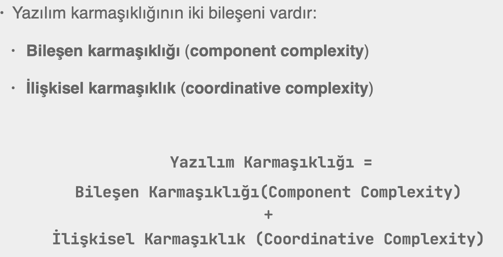

# Section 6: Sınıf Tasarımı

### Konular:

- Karmaşıklık ve Değişim
- Birliktelik (Cohesion)
- Bağımlılık (Coupling)
- Uygulama
- Veri ve Sorumluluk

## 49. Karmaşıklık ve Değişim

## 50. Birliktelik ve Bağımlılık

- **Bileşen karmaşıklığı (Component Complexity)** Bileşenin alt parçalarının ne kadar birlikte olduğunun bir ölçüsüdür ve **Birliktelik** (**Cohesion)** olarak adlandırılır.
    - **Birliktelik**, tek bir amaca/sorumluluğa odaklılıktır (**single responsibility**).
    - Bir sistemde ayrı ayrı her bir parçasının sahip olduğu sorumluluk ne kadar diğer tüm işlerden ayırılmış olursa (**Separation of concerns**) o kadar yüksek **Birlikteliğe (Cohesion)** sahip olduğunu gösterir.
- **Bağımlılık (coupling)**, bir işin diğerleriyle ne kadar ilgili olduğunun ölçüsüdür ve bağımlılığı düşük olan bileşenlerin **İlişkisel Karmaşıklığı (Coordinative Complexity)** de düşüktür. (**loose coupling**)

<aside>
🔑

- Do not depend on concretions, depend on abstractions.
</aside>

<aside>
🔑

- Program to an interface, not an implementation.
</aside>

## 51. Uygulama

- Bir sınıf tasarlarken “bu sınıf neyi bilir?” sorusundan ziyade “bu sınıfın işi nedir/ ne yapar?” sorusu ile yola çıkarsak, soyut kavramlarla yola çıkacağımız için tasarımın en basit haline daha kolay ulaşırız.

## 52. Veri ve Sorumluluk

- Nesnelerin varlık sebebi sorumluluklarıdır.
- Sarmalama (encapsulation), sorumlulukları yerine getirecek şekilde davranış ve veriyi bir araya getirmektir.
- Veri, davranış için vardır.
    - Davranış yoksa veri de yoktur.
    - Veri, davranışın olduğu yerde vardır.
- Bu şekilde veri alış-verişi asgari seviyede olmalıdır.
- Sarmalama (encapsulation) ve bunun bir parçası olan veri saklama (information hiding) prensipleri, verinin dışarıdan korunarak, onu işleyen davranış ile birlikte bir yerde bulunması demektir.
- Yani veri, mümkün olduğunca en yakın yerde işlenmeli, sistem üzerinde işlenmek üzere dağıtılmamalıdır.