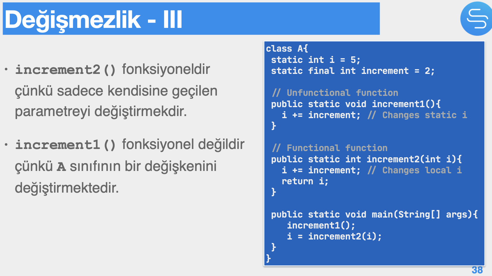
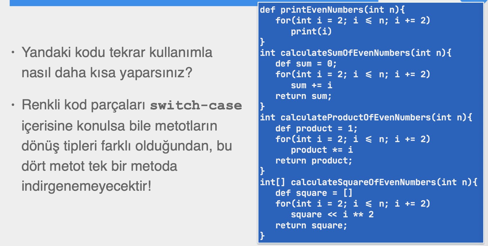
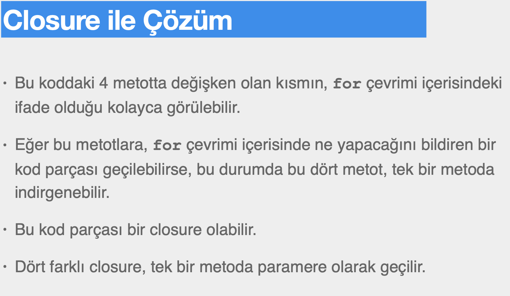
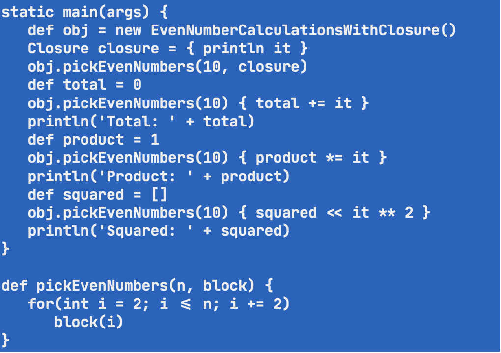

# Section 7: Fonksiyonel Programlamaya Giriş

scala, f sharp, haskel dilleri pure functional dillerdir.

## 53. Giriş

- Procedural/Imperative, Objet Oriented paradigmalarını işledikten sonra, yeni bir paradigma olan Fonksiyonel programlama.

## 54. Tarih ve Temel Kavramlar

- **John Backus**, Fortran’ın mucididir ve 1977’de ACM’in Turing ödülünü

kazanmıştır.

- Backus fonksiyonel dillerde programların daha rahat okunur, anlaşılır ve hatalardan uzak olduğunu idda etti,
    - Çünkü değişken ve durum kavramlarının olmadığı bir sistem önerdi.
- Komutsal dillerde, değişkenlerde temsil edilen durum bilgisi (state) program boyunca sürekli değiştirilir.
    - Program büyüdükçe kontrol edilmesi zorlu bir hale gelir.
- Backus ise sadece matematiksel fonksiyonlardan oluşan bir programlama tavsiye etmiştir.

## 55. Lambda İfadeleri ve Yüksek Seviyeli Fonksiyonlar

- Fonksiyonel programlama dillerinde, fonksiyonların da tipleri vardır ve değişkenlere atanabililer ya da başka bir fonksiyondan döndürülebilirler.

## 56. Fonksiyonel Programlama Nedir?

- J. Backfield, **Becoming Functional** isimli kitabında üzerinde tamamen hemfikir olunmamış temel fonksiyonel programlama özelliklerinden bahseder:
    - First-class function
        - Birinci sınıf olarak fonksiyonlar: Fonksiyonların, yüksek seviyeli fonksiyonlara (ya da birbirlerine) parametre olarak geçilebilmeleri ya da onlardan geri döndürülebilmesidir.
    - Pure functions
        - Öyle fonksiyonlar yazmalıyız ki kendisine geçilen parametre dışında, hiçbir state’ i değiştirmemelidir.
    - Recursion
        - Yineleme ile çok kısa fonksiyonlar yazabiliriz.
    - Immutabile variables
        - Olabildiğince az durum değişikliği yapma yaklaşımının bir sonucu olarak, değeri değişmeyen değişkenler kullanılmaktadır.
    - Non strict evaluation
        - Gevşek Değerleme, değişkenlere oluşturulurken bir ilk değer atama zorunluluğu olmayıp, değişkenin değerinin belirlenmesinin, ilk kullanımına kadar geciktirilmesidir.
    - Statements
        - Cümlelerin de ifadeler (expression) gibi, bir değer üretmesi ve döndürmesidir.
    - Pattern matching
        - Desen eşleme: nesnelerden, daha az değişken kullanımı gerektirecek şekilde, veri/nesne çıkarmaktır.

## 57. Fonksiyonel Programlama a - Değişmezlik ve Saf Fonksiyonlar

- Matematiksel fonksiyonunun (saf fonksiyon (pure function)) en temel özelliği, yan etkisinin (side effect) olmamasıdır.
    - Yani fonksiyon içinde bulunduğu bağlamdan bağımsızdır, ona etki etmez, değiştirmez.
    - Değiştirebileceği sadece kendi yerel değişkenleridir.
    - Bu durum şu iki prensip ile ifade edilir.
        - Immutability (değişmezlik)
        - Referential transparency (İlişkisel şeffaflık/saydalık)
- **Referential transparency (İlişkisel şeffaflık/saydalık):** bir fonksiyonunun aynı parametrelerle çağırılması durumunda daima aynı sonucu üretecek olmasındır.
    - Bu da fonksiyonun saf olmasından dolayıdır, fonksiyonunun üreteceği değeri belirleyen şey sadece ve sadece dışarıdan geçilen parametrelerdir.

- Eğer bir fonksiyonun hiç bir yan etkisi yoksa, sadece kendi yerel değişkenlerini değiştiriyor ve aynı girdiyle daima aynı çıktıyı üretiyorsa, hiçbir zaman yerel olmayan değişkenlerin durumlarının tutarlı olup olmadıklarını kontrol etmeye gerek olmayacaktır.
- Sabite, bir değere verilen isimden ibarettir, Java’ a sabitler final anahtar kelimesi ile oluşturulurlar.
    
    
    
- Programlamaya fonksiyonel yaklaşım, aynı zamanda çok kanallı (multi-threaded) programların davranışlarından emin olunmasını sağlar.
- Eğer bir fonksiyonun hiçbir yan etkisi yoksa, sadece kendi yerel değişkenlerini değiştiriyorsa, bu durumda bu fonksiyonu paralel olarak çağırmanın hiç bir riski yok demektir.
    - Dolayısı ile kilitlemeye (locking ya da synchronizing) gerek yoktur çünkü race condition ve concurrency söz konusu değilidir.
        - Böylece deadlock riski de oluşmaz.

## 58. Fonksiyonel Programlama b - Birinci Sınıf Vatandaş Olarak Fonksiyonlar

- Fonksiyonların birinci sınıf vatandaş (first-class citizen) olması, fonksiyonların da değişkenler gibi davranabilmesidir.
    - Böylece hem parametre geçilebilir hem de onlardan döndürülebilirler.
- Davranış olarak parametrikleştirme (behavior parameterization) sayesinde aynı işi farklı şekillerde yapmak ta söz konusu olabilir.
    - Burada “farklı şekiller” den kasıt, bir değişkenle ifade edilemeyen, farklı algoritmalar, veri işleme vb. kodlardır.

## 59. Farklı Dillerde Fonksiyonel Programlama

- Davranış parametrikleştirme olarak isimsiz bir fonksiyon olan closure’i bir metoda geçmek, kodu bunun yapılamadığı duruma göre daha kısa ve kolay kılabilir.
    - Bunu Michael Feathers şöyle ifade eder:
        - OO makes code understandable by encapsulating moving parts. FP makes code understandable by minimizing moving parts.