# Section 9: Torbalar

## 74. Giriş

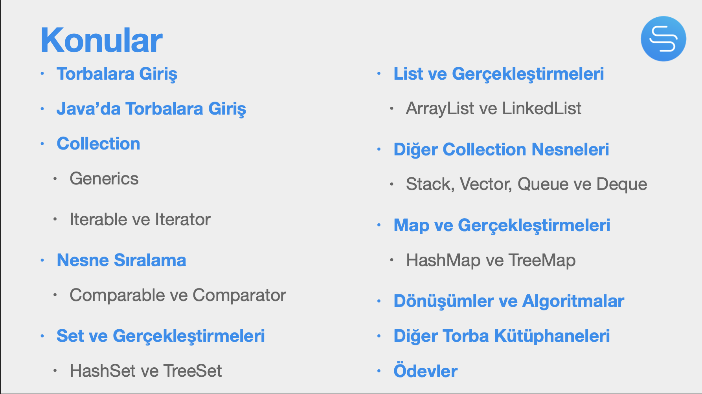

## 75. Torbalara Giriş

- Yapısal olarak torbaların üç tipinden bahsedilebilir.
    - **Doğrusal (lineer) torbalar:** Torbaların iç yapısı farklı olsa bile dışarıya açılan arayüzü, dizi görünümündedir.
        - Dizi (array), List, Vector, Queue ve Dequeue doğrusal torbalardır.
    - **İlişkilendiren (associative) torbalar:** Bir girdiye karşı çıktı üreten (mapping) torbalardır.
        - Bazen eleman, verilen bir anahtarla (key) ilişkilendirilerek saklanır.
        - **Map** ve **HashTable**
        - Bazen eleman, dışarıdan verilmeyen, torba tarafından üretilen bir veri ile ilişkilendirilerek tutulur.
            - Bu tür yapılarda en sık kullanılan veri hash koddur.
        - Saklanan elemana bu şekilde erişim çok hızlıdır.
        - **Set** hash kod kullanarak ilişkilendiren torbalardandır.

## 76. Java'da Torbalara Giriş

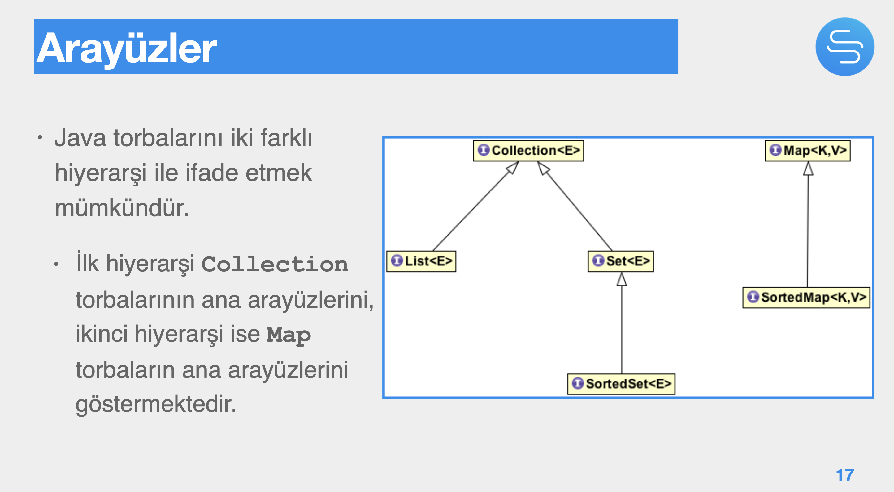

## 77. Collection

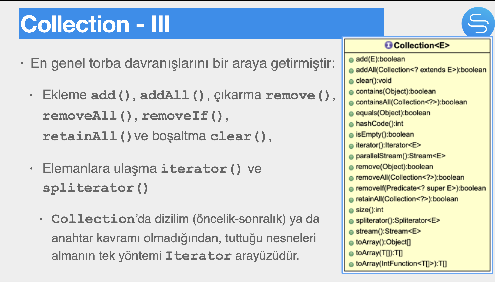

## 78. Diğer Bazı Arayüzler

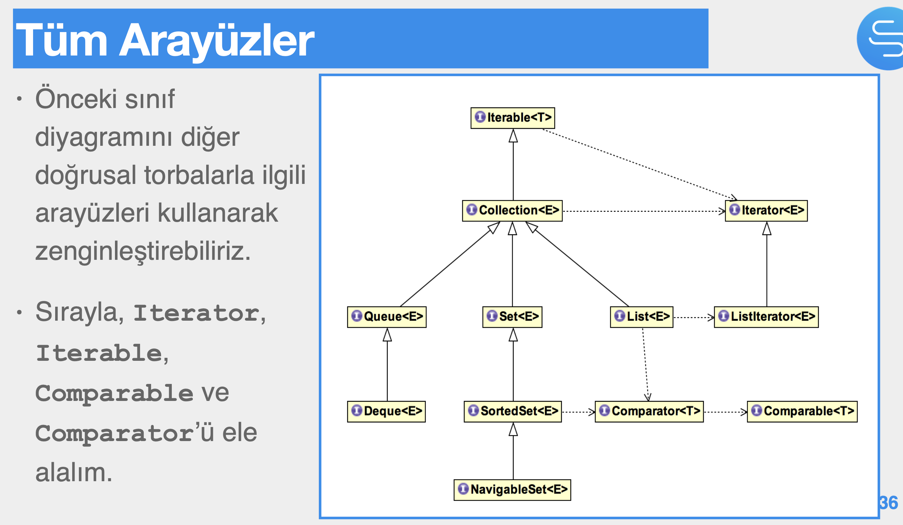

## 79. Diğer Bazı Arayüzler - a - Iterator

- **Collection** tipindeki torbalarda elemanlara ulaşmanın tek yöntemi `java.util.Iterator` arayüzüdür.

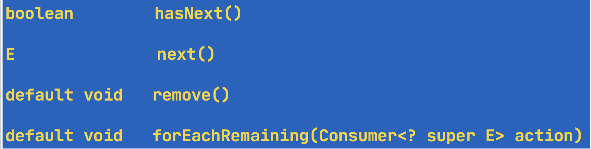

- **Iterator**, o koleksiyonun elemanlarını `remove()` ile silebilir.
    - `remove()` her bir `next()` çağrısı için sadece bir defa çağrılmaldır.
- **Collection** nesnesi, kendisinden **Iterator** alındıktan sonra üzerindeki `add()` ya da `remove()` ile değiştirilirse, iterator üzerinde yapılan ill next çağrısında `java.util.ConcurrentModificationException` sıra dışı durumu fırlatılır.
    - Buna **fail-fast** denir, yani iterator durumu algılar algılamaz hata verir.
    - Bu yüzden **Iterator** oluşturulduktan sonra koleksiyondan silme **Iterator** üzerindeki `remove()` metodu ile yapılmalıdır.
    - Ekleme ise, koleksiyondan henüz **Iterator** alınmadan önce tamamlanmalıdır.
    - **Iterator** nesnesinin işi bittiğinde (yani `hasNext()` metodu `false` döndürdüğünde) bu hata oluşturan durum ortadan kalkar.

## 80. Diğer Bazı Arayüzler - b - Iterable

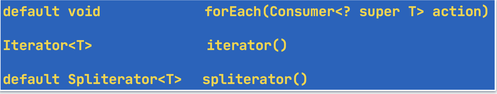

- **Iterable** arayüzünü gerçekleştiren sınıfların nesneleri `forEach()` ile elemanlarının işlenebilmesine imkan verir.

## 81. Diğer Bazı Arayüzler - c - Comparable

- `java.lang.Comparable` arayüzü, onu gerçekleştiren nesnelerin sıralanabilmesini sağlar.
    - fonksiyonel bir arayüzdür.
    - Üzerindeki tek soyut metot: `int compareTo(T o)`
- Üzerinde `compareTo()` metodu çağırılan nesne parametre geçilenden büyükse pozitif, küçükse negatif, eşitler ise sıfır döndürür.

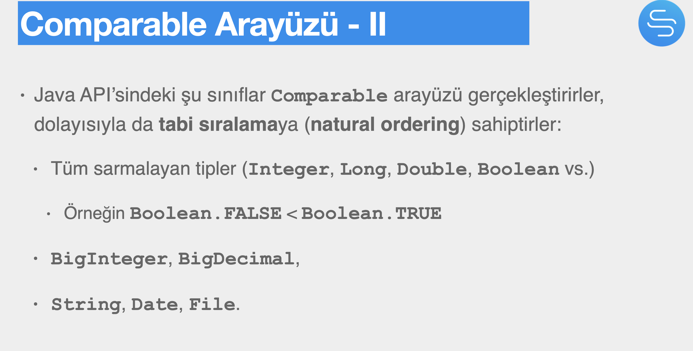

## 82. Diğer Bazı Arayüzler - d - Comparator

- Eğer sıralanacak nesneler **Comparable** arayüzünü gerçekleştirmiyorsa ya da birden çok kıyaslama söz konusuysa;
    - Bu sınıfları third party hizmet olarak alıyorsak (sadece compiled class koduna ulaşıyorsak)
    - Bu durumlarda `java.util.Comprator`  arayüzü, nesnelerin sıralanmasında kullanılabilir.

## 83. Collection Torbaları

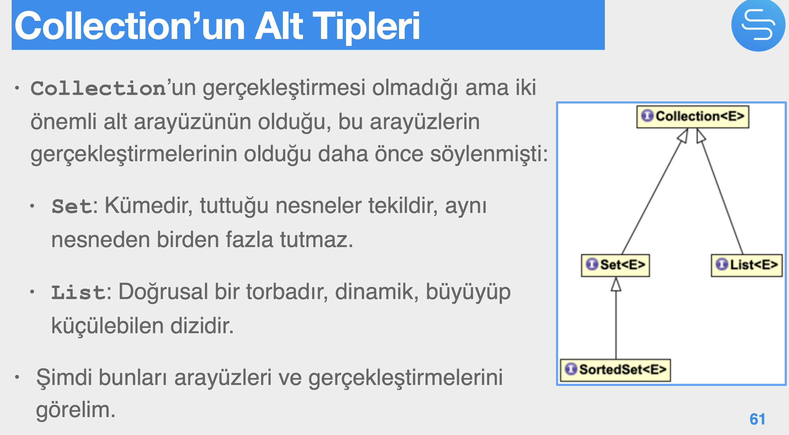

## 84. Set ve Gerçekleştirmeleri

- Matematikteki kümeleri temsil eder.
- Dizilim ya da sıra kavramı yoktur.
- Elemanlarına ancak **Iterator** ile ulaşılabilir.
- Collection’ dan en bariz farkı, `add()` ve `addAll()` metotlarında aynılık kontrolü yapar.
    - Dolayısıyla bu metotlarıda `false` döndürebilir.
- `static <E> Set<E> of(E … elements)` metodu ile **array** geçilen parametrelerden set üretilebilir.
    - Parametre boş geçilirse boş bir set üretir.
- `static <E> Set<E> copyOf(Collection<? extends E> coll)` ****metodu ile **Collection** tipinde parametre geçerek **Set** üretilebilir.
    - Bu metotlar değiştirilemez (unmodifiable) **Set** set nesnesi oluşturur.
    - Oluşturulan **Set** değiştirilmeye çalışıldığında `java.lang.UnsupportedOperationException` fırlatır.
    - Ayrıca bu şekilde oluşturulan **Set,** null elemanlara izin vermez, null ile oluşturulmaya çalışıldığında `NullPointerException` fırlatır.
- Set arayüzünün en temel iki adet gerçekleştirmesi vardır.
    
    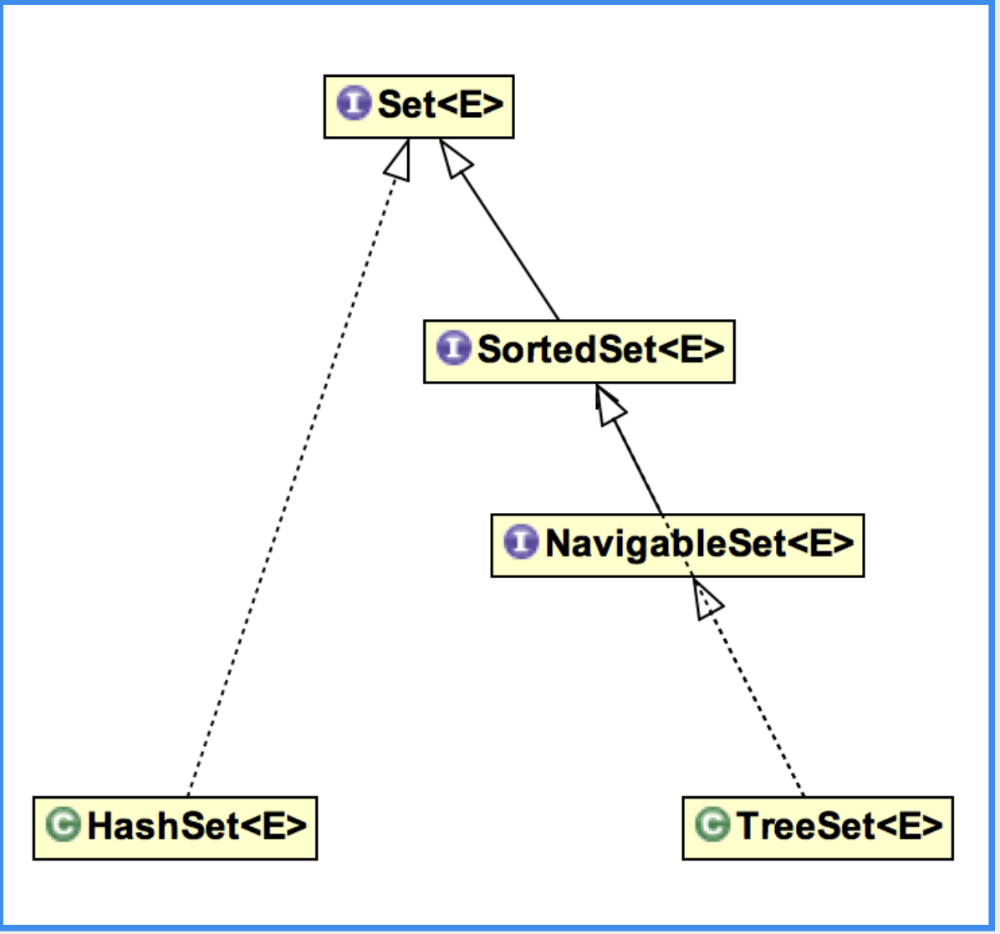
    
- `HashSet` en sık kullanılan **Set** gerçekleştirmesidir.
- `TreeSet` ise **Set’** in alt arayüzleri olan **SortedSet** ve **NavigableSet** arayüzlerini gerçekleştirir ve genelde sadece sıralama gerektiren senaryolarada kullanılır.

## 85. Set ve Gerçekleştirmeleri - a - HashSet

- **HashSet**, arka tarafta desteklenen bir **Set** gerçekleştirmesidir.
- `add(), remove(), contains() ve size()` fonksiyonlarında, **O(1)** performans sağlar.
- Elemanlarına ancak **Iterator** ile erişilir, bu da eleman sayısıyla orantılı lineer bir performans verir.
- 4 farklı kurucusu vardır.
    - Varsayılan kurucuda başlangıç kapasitesi 16 ve doluluk oranı 0.75 olan boş bir **HashSet** oluşturulurken;
    - Arzu edilirse başlangıç kapasitesi ve doluluk oranı kurucuda verilebilir.
        - Doluluk oranından arta kalan kısım, **Set’** in daima boşta tutulacak yüzdelik kapasitesini ifade eder.
        - Yani varsayılan kurucuda, %25 lik bir boşluk kaldığında **HashSet** kapasitesini artırır.
        
        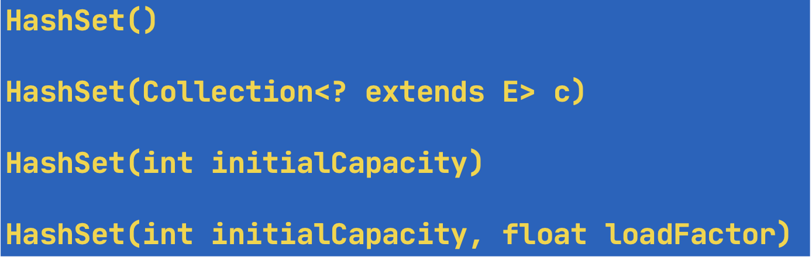
        
- **HashSet,** iki elemanın aynı olup olmadığına, o elemanların **hashCode** ve **equals** metotlarını çağırarak bakar.
    - Önce **hashCode()** çağrılır, dönen sonuçlar aynı ise **equals()** çağrılır, **equals()** methodu da `true` döndürürse obje set’ e eklenmez.
    - Aksi durumlarda eklenir.

## 86. Set ve Gerçekleştirmeleri - b - Hashing ve Hash Fonksiyonları

- Hash fonksiyonlarının, aynı girdi için aynı değeri, her bir farklı girdi için farklı değer üretmesi beklenir.
- `hashCode()` metodunun özelliği, tutarlılık açısından `equals()` metodunun `true` döndürdüğü nesneler için aynı int değeri hash olarak döndürmesidir.

## 87. Set ve Gerçekleştirmeleri - c - TreeSet

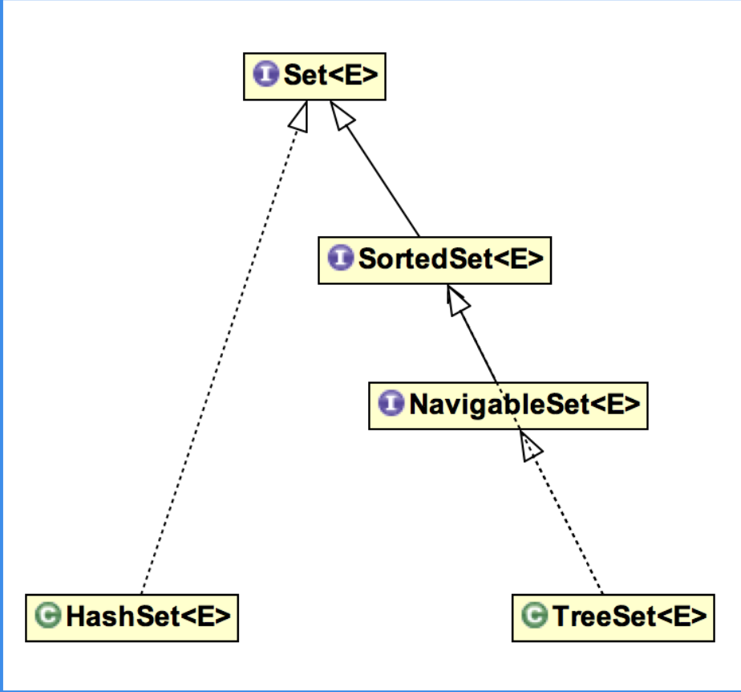

- Elemanlarını sıralı (sorted) tutan bir **Set** gerçekleştirmesidir.
- **TreeSet** temel fonksiyonlarında (`add()`, `remove()`, `contains()`) **O(lgn)** performans sağlar.
- **java.util.SortedSet,** elemanları üzerinde sıralama yapan **Set’** tir.
    - Elemanları, **Comparable** arayüzünü gerçekleştirmelidir.
    - Ya da **SortedSet** gerçekleştirmesine Comparator geçilmelidir.
        
        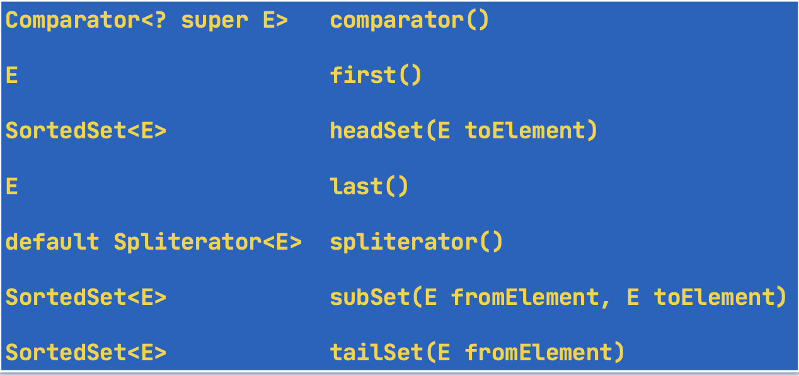
        
- **java.util.NavigableSet**, **SortedSet**’ in yapı içinde arama amacıyla gezmeye ve aranana en yakın elemanı bulmaya izin veren arayüzdür.
    
    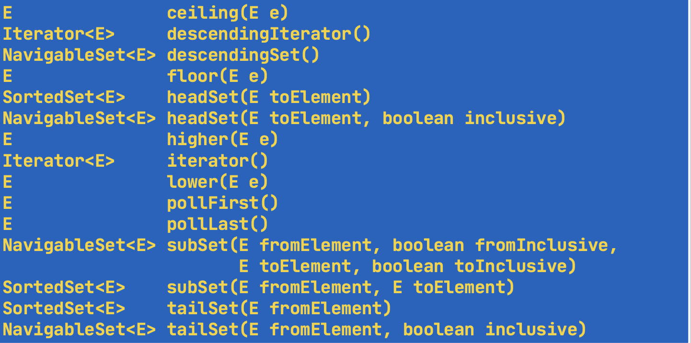
    
- **TreeSet,** eklenen elemanları sıralamak için;
    - Eğer elemanların tabi dizilişi (natural ordering) varsa yani gerçekleştiriyorlarsa **Comparable** arayüzünü,
    - **Comparable** arayüzünü gerçekleştirmiyorlarsa **TreeSet**’ e geçilen **Comparator** arayüzünü kullanır.
- Aşağıdaki 4 kurucuya sahiptir:
    
    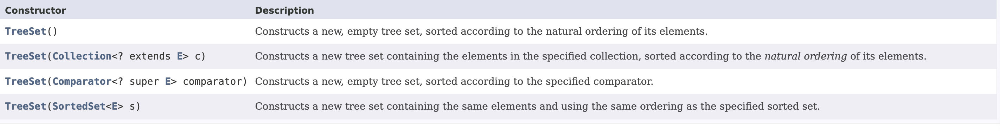
    
- Varsayılan kurucu, set’ in elemanlarının doğal sıralanabilir olduğunu varsayar. (Aksi takdirde **ClassCastException** üretir.)
- **TreeSet’** e eklenecek elemanların sınıflarında `equals()`, `hashCode()` ve **Comparable** arayüzünden gelen `compareTo()` ya da **Comparator** arayüzündeki `compare()` metotlarının tutarlı bir şekilde implement edilmesi gerekir.
    - `equals()` ’ ın `true` döndürdüğü nesnelerin gerçekleştirdiği **Comparable** arayüzünün `compareTo()` ya da **Comparator** arayüzündeki `compare()` metotları da 0 döndürmelidir.

## 88. List ve Gerçekleştirmeleri

- **List** dizilime sahip olduğundan dolayı `add(E e)` metodu ve `addAll(Collection <? extends E> c)` metotları listenin sonuna ekler.
- **List** unmodifiable olmadığı sürece, ekleme metotları daima `true` döndürür.
- **List** arayüzü, **Collection**‘ dan devraldığı davranışlara Index kavramının getirdiği eklemeler yapar.
    - Bu ek metotlarda yer (index) bilgisi bulunur.
        
        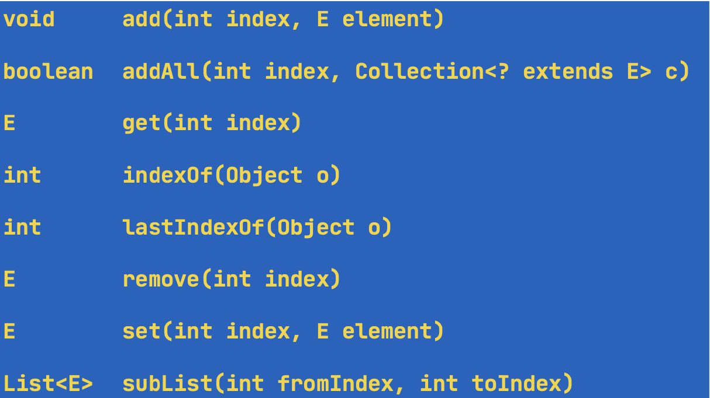
        
- **List,** tüm Collection nesneleri gibi **Iterable’** dir ve `interator()` metodunu devralır.
    - Ayrıca elemanlarına tek tek ulaşılabilmesi için **ListIterator** döndüren iki yeni metot `listIterator()` ve `listIterator(int index)` ekler.
    - `listIterator()` tüm elemanları, `listIterator(int index)` ise verilen index’ ten itibaren elemanları iterate eder.
        
        
        
- **ListIterator, Iterator** arayüzünden miras alır.
    
    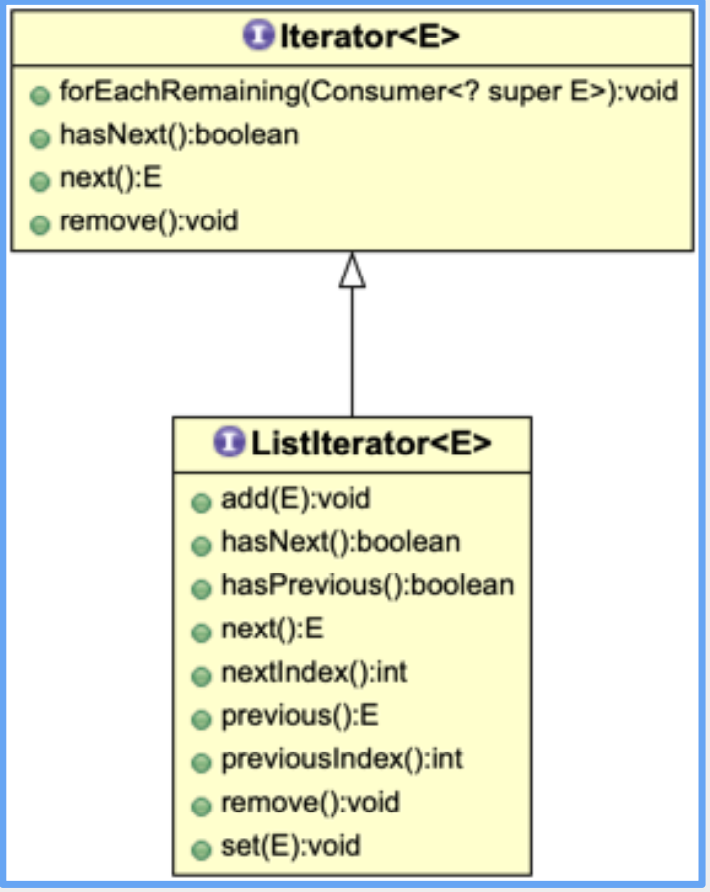
    
- **ListIterator,** elemanlara, ileri ve geri, iki yönde ulaşım sağlar.
    - `hasNext()` ve `next()` ile `hasPrevious()` ve `previous()`
    - `nextIndex()` ve `previousIndex()`
        
        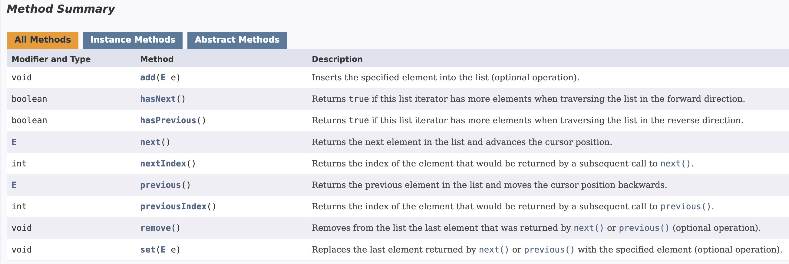
        
- **List** arayüzünün çok sık kullanılan iki gerçekleştirmesi vardır:
    - **ArrayList:** Standart ve en çok kullanılan dinamik dizi gerçekleştirmesidir.
    - **LinkedList:** Bağlı liste gerçekleştirmesidir.

## 89. List ve Gerçekleştirmeleri - a - ArrayList ve LinkedList

- **ArrayList’**in üç tane kurucusu vardır.
    - **ArrayList**’ in varsayılan kurucusu boş bir liste oluşturur.
    - **ArrayList’** in girilen değer kadar odaya sahip olan bir nesne oluşturan kurucusu ile geçilen **Collection**’ un elemanlarıyla list oluşturan kurucusu da vardır.
        
        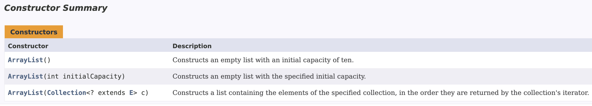
        
- **LinkedList,** bağlı listedir.
- **LinkedList**’ deki her eleman, sağ ve sol taraftaki komşularını bilir.
- **LinkedList’** in iki kurucusu vardır
    - Varsayılan kurucu boş bir list,
    - diğeri ise geçilen **Collection**’ un elemanlarıyla list oluşturur.
        
        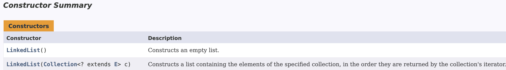
        
- **LinkedList,** ayrıca **Queue** ve **Dequeue** arayüzlerini gerçekleştirir, bundan dolayı **ArrayList**’ ten farklı metotları varıdır.
    
    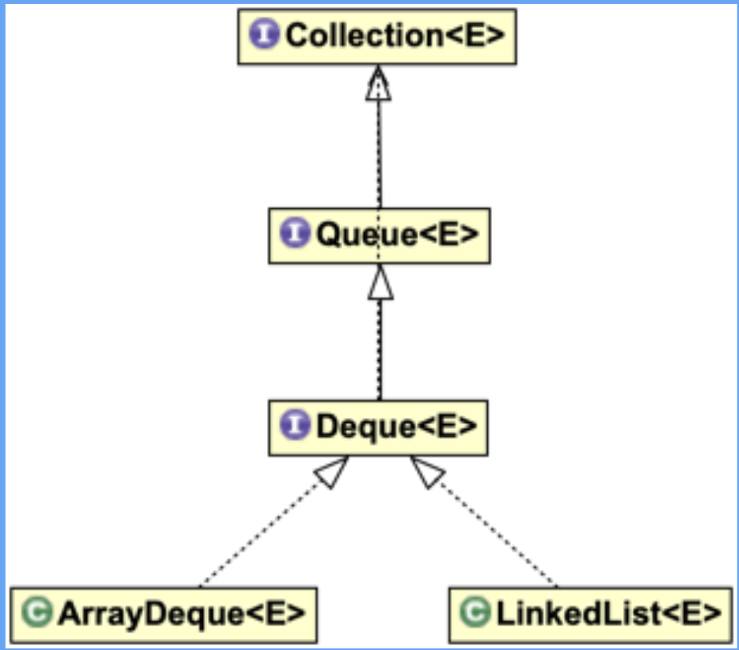
    
- Erişimde **ArrayList** sabit, **O(1)** performansa sahipken **LinkedList** elemanı linkler üzerinden giderek bulduğu için doğrusal bir performansa **O(n)** sahiptir.
- Ekleme ve çıkarmada **(add() & remove())**
    - **ArrayList O(n)**
    - **LinkedList** ise sabit, **O(1)** performansa sahiptir.
- Dolayısıyla, başa ya da araya ekleme-çıkarma yapılmadığı senaryolarda **ArrayList** tercih edilmelidir.
    - Çünkü **LinkedList’** te eleman erişimi, linkler üzerinden gidilerek yapıldığından lineer performanslıdır, pahalıdır.
- Ama başa ya da araya ekleme-çıkarma yapılacaksa **LinkedList** tercih edilmelidir.
    - Çünkü **ArrayList’** te sona yapılanlar dışındaki ekleme-çıkarma işlemleri doğrusal karmaşıklığa sahiptir, pahalıdır.
- Arama, örneğin `contains()` metot çağrısı, her iki yapı için de **O(n)** performanslıdır.

## 94. Map Arayüzü

- **Map<K,V>,** elemanlarını anahtar nesnelerle eşleştirerek tutan torbaların ana arayüzüdür.
- **Map**’ te ekleme metodu `V put (K, V)`
    - geçilen anahtar ile ilişkili bir değer barsa onu geçilen değer ile değiştirir ve eski değeri geri döndürür, yoksa `null` döndürür.
    - Çünkü **Map**’ te aynı anahtarla ilişkili sadece tek bir değer olabilir.
        
        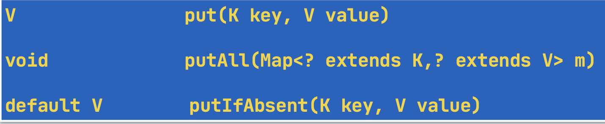
        
- Eğer Map’ te anahtar yoksa değeri ile birlikte eklenmesi isteniyorsa `putIfAbsent()` kullanılmalıdır.
- **Map**’ ten değer almak için anahtar verilir, anahtara karşı gelen değer alınır `V get(K)`
- Eğer **Map**‘ te anahtara karşı gelen bir değer yoksa, varsayılan bir değerin dönmesi sağlanabilir. `default V getOrDefault(K, V)`
    
    
    
- Map’ de anahtarlar ve değerlerini ayrı ayrı almak için önce `keySet()` ile anahtar **Set**’ i alınır ve anahtarlar üzerinden **Iterator** ile geçilir,
    - Her anahtar `get()` metoduna geçilerek karşı gelen değeri alınır.
        
        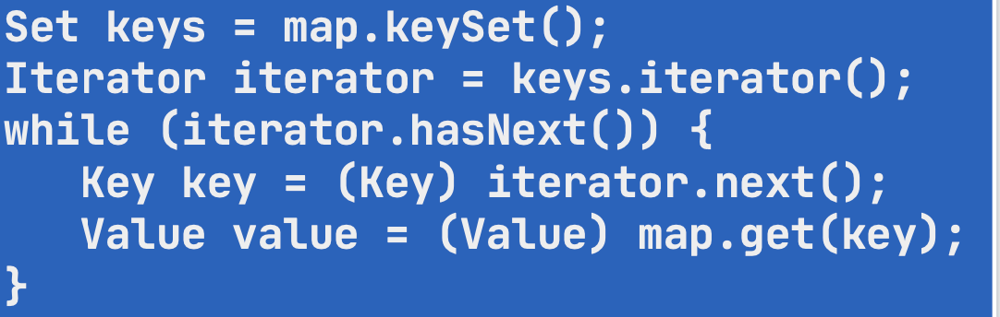
        
- **Map**’ ten hem anahtar hem de anahtar-değer ikilisiyle silme yapılabilir.
    - `V remove(Object key)`
    - `default boolean remove(Object key, Object value)`
- `clear()` ile tüm anahtar ve değerler silinebilir.
- Sorgulama metotları:
    
    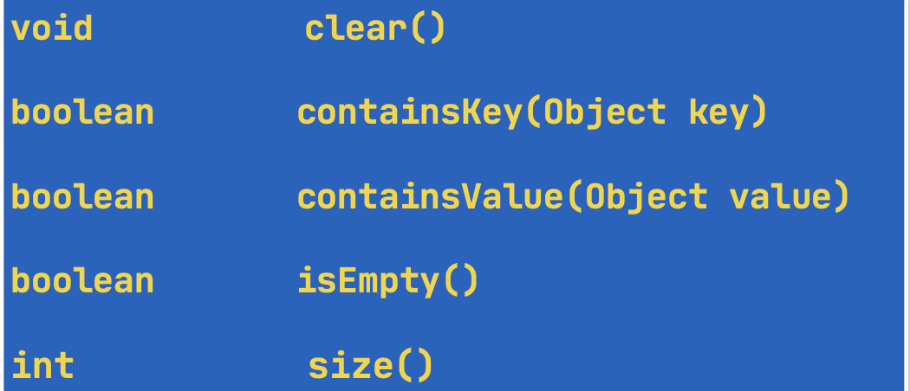
    
- **Map** arayüzünün en temel iki gerçekleştirmesi vardır:
    - **HashMap**, **Map’** i doğrudan gerçekleştirir ve en sık kullanılandır.
    - **TreeMap** ise **Map’** in alt arayüzleri olan **SortedMap** ve **NavigableMap’** i de gerçekleştirir ve anahtarların sıralanması gerektiğinde kullanılır.
        
        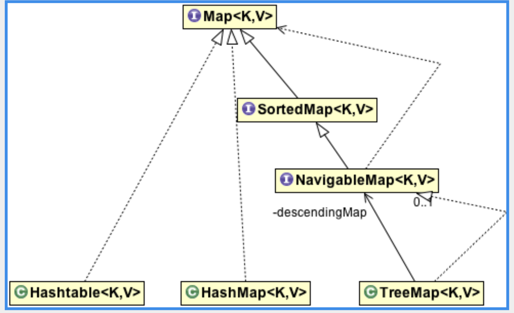
        

## 95. Map Gerçekleştirmeleri - a - HashMap

- **HashMap**, anahtarlar ya da değerler için herhangi bir dizilim sözü vermez, var olan dizilim zaman içinde değişebilir.
- **HashMap,** anahtar ya da değer olarak `null` referanslara izin verir.
- **HashMap**, temel metotlarında (`put()`, `remove()`, `contains()` ve `get()` ) sabite yakın, **O(1)** performans sağlar.
- 4 adet kurucuya sahiptir.
    - Varsayılan kurucu başlangıç kapasitesi 16 ve doluluk oranı 0.75 olan boş bir **HashMap** oluşturur, arzu edilirse bu değerler kurucuya geçilebilir.
    - Var olan **Map** kullanılarak yeni bir **HashMap** oluşturulabilir.
        
        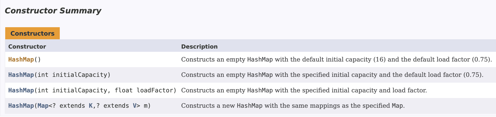
        

## 96. Map Gerçekleştirmeleri - b - TreeMap

- **TreeMap**, anahtarları sıralayan bir **Map** gerçekleştirmesidir.
    - Hem **SortedMap** hem de **NavigableMap’** tir.
- Anahtar olarak `null` ’ a izin vermez ama değer olarak `null` ’a izin verir.
- **TreeMap,** temel fonksiyonlarında (`put()`, `remove()`, `contains()` ve `get()`) **O(lgn)** (2 tabanında) bir performans sağlar.
- 4 adet kurucuya sahiptir.
    
    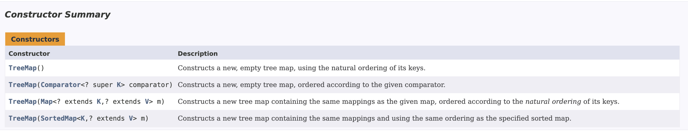
    
- Anahtarlar **Comparable** arayüzünü gerçekleştirmelidir.
    - Ya da **SortedMap** gerçekleştirmesine **Comparator** geçilmelidir.

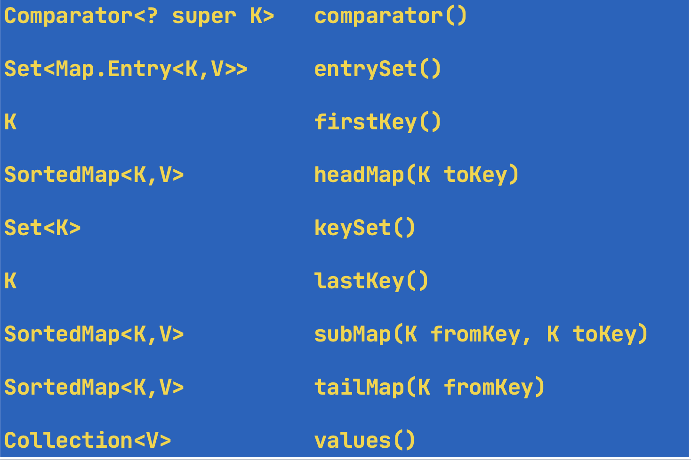